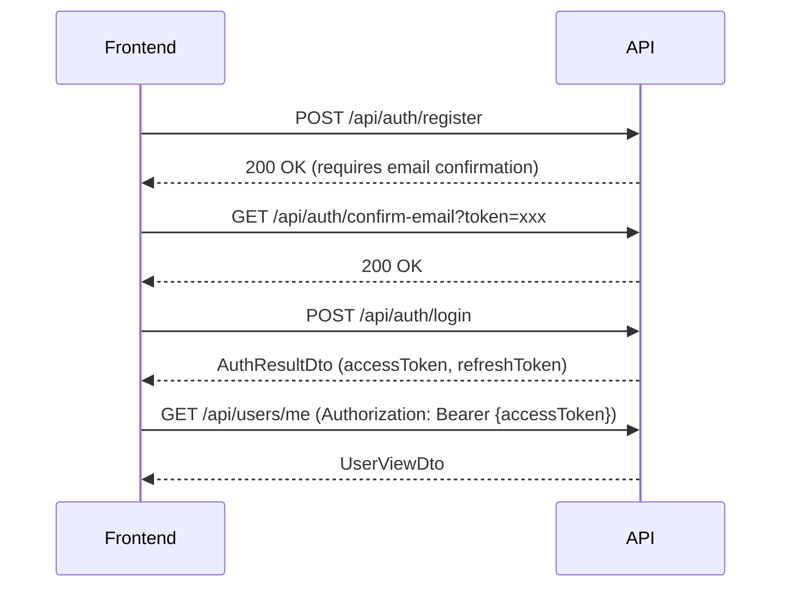

# SmartHome API Specification for Frontend Development

> **Tài liệu đầy đủ về API endpoints cho Frontend Developer**  
> Version: 2.0  
> Last Updated: 2025-01-19  
> Base URL: `https://localhost:7140/api` (Development)

---

## 📋 Table of Contents

1. [Authentication Flow](#authentication-flow)
2. [Authorization & Token Management](#authorization--token-management)
3. [API Endpoints by Module](#api-endpoints-by-module)
   - [Authentication](#1-authentication-endpoints)
   - [User Management](#2-user-management)
   - [Home Management](#3-home-management)
   - [Room Management](#4-room-management)
   - [Device Management](#5-device-management)
   - [Automation Management](#6-automation-management)
   - [Scene Management](#7-scene-management)
   - [Sensor Data](#8-sensor-data)
   - [Payment & Packages](#9-payment--service-packages)
   - [Support Requests](#10-support-requests)
   - [Face Recognition](#11-face-recognition)
   - [Admin Operations](#12-admin-operations)
   - [Health & Monitoring](#13-health--monitoring)
   - [Statistics & Dashboard](#14-statistics--dashboard)
   - [Service Status History](#15-service-status-history)

---

## 🔐 Authentication Flow

### Quy trình xác thực cơ bản



### Token Management

#### Access Token
- **Loại**: JWT Bearer Token
- **Thời gian sống**: 60 phút (mặc định)
- **Gửi qua Header**: 
  ```
  Authorization: Bearer {accessToken}
  ```
- **Chứa thông tin**: userId, email, role (ADMIN/CUSTOMER)

#### Refresh Token
- **Loại**: Secure random string
- **Thời gian sống**: 7 ngày (mặc định)
- **Lưu trữ**: Secure storage (localStorage/sessionStorage/cookie)
- **Sử dụng**: Khi accessToken hết hạn, gọi `/api/auth/refresh` để lấy token mới

#### Quy trình Refresh Token

```javascript
// Pseudo-code
if (accessTokenExpired()) {
  const response = await fetch('/api/auth/refresh', {
    method: 'POST',
    headers: { 'Content-Type': 'application/json' },
    body: JSON.stringify({
      accessToken: oldAccessToken,
      refreshToken: storedRefreshToken
    })
  });
  
  if (response.ok) {
    const { accessToken, refreshToken } = await response.json();
    // Lưu token mới và retry request gốc
  } else {
    // Redirect to login
  }
}
```

---

## 🌐 API Endpoints by Module

---

## 1. Authentication Endpoints

### 1.1. POST /api/auth/register
**Chức năng**: Đăng ký tài khoản Customer mới

**Auth**: Public (không cần token)

**Request Body**:
```json
{
  "email": "string (required, email format)",
  "password": "string (required, min 8 chars)",
  "fullName": "string (required)",
  "phoneNumber": "string? (optional)"
}
```

**Response 200 OK**:
```json
{
  "isSuccess": true,
  "message": "Registration successful. Please check your email to confirm your account.",
  "errors": [],
  "accessToken": null,
  "refreshToken": null,
  "role": null,
  "userId": null,
  "expiresAt": null
}
```

**Response 400 Bad Request**:
```json
{
  "isSuccess": false,
  "message": "Registration failed",
  "errors": ["Email already exists", "Password too weak"],
  "accessToken": null,
  "refreshToken": null,
  "role": null,
  "userId": null,
  "expiresAt": null
}
```

---

### 1.2. POST /api/auth/login
**Chức năng**: Đăng nhập hệ thống

**Auth**: Public

**Request Body**:
```json
{
  "email": "string (required)",
  "password": "string (required)"
}
```

**Response 200 OK**:
```json
{
  "accessToken": "eyJhbGciOiJIUzI1NiIsInR5cCI6IkpXVCJ9...",
  "refreshToken": "550e8400-e29b-41d4-a716-446655440000",
  "role": "CUSTOMER | ADMIN",
  "userId": 123,
  "expiresAt": 1735123456789
}
```

**Response 401 Unauthorized**:
```json
{
  "type": "https://tools.ietf.org/html/rfc7235#section-3.1",
  "title": "Unauthorized",
  "status": 401,
  "detail": "Invalid email or password"
}
```

---

### 1.3. POST /api/auth/refresh-token
**Chức năng**: Làm mới access token khi hết hạn

**Auth**: Public (nhưng cần refreshToken hợp lệ)

**Request Body**:
```json
{
  "accessToken": "string (expired token)",
  "refreshToken": "string (valid refresh token)"
}
```

**Response 200 OK**:
```json
{
  "accessToken": "eyJhbGciOiJIUzI1NiIsInR5cCI6IkpXVCJ9...",
  "refreshToken": "new-refresh-token-uuid",
  "role": "CUSTOMER",
  "userId": 123,
  "expiresAt": 1735127056789
}
```

**Response 401 Unauthorized**:
```json
{
  "type": "https://tools.ietf.org/html/rfc7235#section-3.1",
  "title": "Unauthorized",
  "status": 401,
  "detail": "Invalid or expired refresh token"
}
```

---

### 1.4. POST /api/auth/revoke-token
**Chức năng**: Thu hồi refresh token (logout)

**Auth**: Required (Bearer token)

**Request Body**: Không cần body, sử dụng JWT token trong header để xác định user

**Response 200 OK**:
```json
{
  "message": "Token revoked successfully"
}
```

---

### 1.5. GET /api/auth/confirm-email
**Chức năng**: Xác nhận email sau khi đăng ký

**Auth**: Public

**Query Parameters**:
- `token`: string (required) - Email confirmation token

**Response 200 OK**:
```json
{
  "isSuccess": true,
  "message": "Email confirmed successfully",
  "errors": []
}
```

**Response 400 Bad Request**:
```json
{
  "isSuccess": false,
  "message": "Email confirmation failed",
  "errors": ["Invalid or expired token"]
}
```

---

### 1.6. POST /api/auth/resend-confirmation-email
**Chức năng**: Gửi lại email xác nhận

**Auth**: Public

**Request Body**:
```json
{
  "email": "string (required)"
}
```

**Response 200 OK**:
```json
{
  "isSuccess": true,
  "message": "Confirmation email sent",
  "errors": []
}
```

---

### 1.7. POST /api/auth/forgot-password
**Chức năng**: Yêu cầu reset mật khẩu (gửi email)

**Auth**: Public

**Request Body**:
```json
{
  "email": "string (required)"
}
```

**Response 200 OK**:
```json
{
  "message": "If this email exists, a reset link has been sent",
  "resetUrl": "https://frontend.com/reset-password?token=xxx&email=user@example.com"
}
```

---

### 1.8. GET /api/auth/reset-password
**Chức năng**: Hiển thị form reset password (từ link trong email)

**Auth**: Public

**Query Parameters**:
- `email`: string (required)
- `token`: string (required)

**Response 200 OK**: HTML page với form reset password

---

### 1.9. POST /api/auth/reset-password-by-email
**Chức năng**: Reset mật khẩu bằng token từ email

**Auth**: Public

**Request Body** (hoặc Query Parameters):
```json
{
  "email": "string (required)",
  "token": "string (required, from email)",
  "newPassword": "string (required, min 8 chars)",
  "confirmPassword": "string? (optional)"
}
```

**Response 200 OK**:
```json
{
  "isSuccess": true,
  "message": "Password reset successfully",
  "errors": []
}
```

---

### 1.10. POST /api/auth/google-login
**Chức năng**: Đăng nhập bằng Google (cho user đã đăng ký)

**Auth**: Public

**Request Body**:
```json
{
  "idToken": "string (Google ID Token)"
}
```

**Response 200 OK**: Giống `/api/auth/login`

---

### 1.11. POST /api/auth/google-register
**Chức năng**: Đăng ký tài khoản mới bằng Google

**Auth**: Public

**Request Body**:
```json
{
  "idToken": "string (Google ID Token)",
  "phoneNumber": "string? (optional)"
}
```

**Response 200 OK**: Giống `/api/auth/login` (tự động login sau khi register)

---

## 2. User Management

### 2.1. GET /api/users/me
**Chức năng**: Lấy thông tin profile của user đang đăng nhập

**Auth**: Required (AdminOrCustomer)

**Response 200 OK**:
```json
{
  "userId": 123,
  "email": "user@example.com",
  "fullName": "Nguyễn Văn A",
  "role": "CUSTOMER",
  "phoneNumber": "0901234567",
  "emailConfirmed": true,
  "serviceStatus": "ACTIVE",
  "serviceExpiryDate": "2025-12-31T23:59:59",
  "address": "123 Nguyễn Huệ, Q1, HCM",
  "currentPackageId": 2,
  "createdAt": "2025-01-01T00:00:00"
}
```

---

### 2.2. PUT /api/users/profile
**Chức năng**: Cập nhật profile của user đang đăng nhập

**Auth**: Required (AdminOrCustomer)

**Request Body**:
```json
{
  "fullName": "string? (optional)",
  "phoneNumber": "string? (optional)",
  "address": "string? (optional)"
}
```

**Note**: Để đổi mật khẩu, sử dụng endpoint `/api/users/change-password` riêng biệt.

**Response 200 OK**:
```json
{
  "userId": 123,
  "email": "user@example.com",
  "fullName": "Nguyễn Văn A (Updated)",
  ...
}
```

---

### 2.3. PUT /api/users/change-password
**Chức năng**: Đổi mật khẩu (yêu cầu mật khẩu cũ)

**Auth**: Required (AdminOrCustomer)

**Request Body**:
```json
{
  "currentPassword": "string (required)",
  "newPassword": "string (required, min 8 chars)"
}
```

**Response 200 OK**:
```json
{
  "message": "Password changed successfully"
}
```

**Response 400 Bad Request**:
```json
{
  "type": "https://tools.ietf.org/html/rfc7231#section-6.5.1",
  "title": "Bad Request",
  "status": 400,
  "detail": "Current password is incorrect"
}
```

---

### 2.4. GET /api/users (Admin Only)
**Chức năng**: Lấy danh sách tất cả users (phân trang)

**Auth**: Required (AdminOnly)

**Query Parameters**:
- `page`: int (default: 1)
- `pageSize`: int (default: 10)

**Response 200 OK**:
```json
{
  "items": [
    {
      "userId": 1,
      "email": "user@example.com",
      "fullName": "Nguyễn Văn A",
      "role": "CUSTOMER",
      ...
    }
  ],
  "page": 1,
  "pageSize": 10,
  "totalCount": 100,
  "totalPages": 10
}
```

---

### 2.5. GET /api/users/{id} (Admin Only)
**Chức năng**: Lấy thông tin user theo ID

**Auth**: Required (AdminOnly)

**Path Parameters**:
- `id`: int (User ID)

**Response 200 OK**: Giống GET /api/users/me

---

### 2.6. POST /api/users (Admin Only)
**Chức năng**: Tạo user mới (Admin tạo Customer hoặc Admin khác)

**Auth**: Required (AdminOnly)

**Request Body**:
```json
{
  "email": "string (required)",
  "password": "string (required)",
  "fullName": "string (required)",
  "role": "ADMIN | CUSTOMER (required)",
  "phoneNumber": "string? (optional)",
  "serviceExpiryDate": "DateTime? (optional)",
  "address": "string? (optional)",
  "currentPackageId": "int? (optional)"
}
```

**Response 201 Created**: UserViewDto

---

### 2.7. PUT /api/users/{id} (Admin Only)
**Chức năng**: Cập nhật thông tin user (Admin cập nhật bất kỳ user nào)

**Auth**: Required (AdminOnly)

**Request Body**:
```json
{
  "fullName": "string? (optional)",
  "role": "string? (optional)",
  "phoneNumber": "string? (optional)",
  "serviceStatus": "string? (optional)",
  "serviceExpiryDate": "DateTime? (optional)",
  "address": "string? (optional)",
  "currentPackageId": "int? (optional)"
}
```

**Response 200 OK**: UserViewDto

---

### 2.8. DELETE /api/users/{id} (Admin Only)
**Chức năng**: Xóa user

**Auth**: Required (AdminOnly)

**Response 204 No Content**

---

### 2.9. PATCH /api/users/{id}/status (Admin Only)
**Chức năng**: Cập nhật trạng thái service của user

**Auth**: Required (AdminOnly)

**Request Body**:
```json
{
  "serviceStatus": "ACTIVE | SUSPENDED | EXPIRED (required)"
}
```

**Response 204 No Content**

---

### 2.10. POST /api/users/{id}/activate (Admin Only)
**Chức năng**: Kích hoạt dịch vụ cho user (chuyển từ INSTALLING sang ACTIVE)

**Auth**: Required (AdminOnly)

**Request Body**:
```json
{
  "note": "string? (optional)"
}
```

**Response 204 No Content**

---

## 3. Home Management

### 3.1. GET /api/homes/{id}
**Chức năng**: Lấy thông tin Home theo ID (với authorization check)

**Auth**: Required (AdminOrCustomer, Customer chỉ xem Home của mình)

**Response 200 OK**:
```json
{
  "homeId": 1,
  "name": "Nhà của tôi",
  "ownerId": 123,
  "securityStatus": "ARMED | DISARMED"
}
```

**Response 403 Forbidden**: Nếu Customer cố gắng xem Home của người khác

---

### 3.2. GET /api/homes/{id}/profile
**Chức năng**: Lấy thông tin đầy đủ về Home (bao gồm Rooms, Devices, thống kê)

**Auth**: Required (AdminOrCustomer, Customer chỉ xem Home của mình)

**Response 200 OK**: HomeProfileDto (xem chi tiết trong models.md)

---

### 3.3. GET /api/homes (Admin Only)
**Chức năng**: Lấy tất cả Homes trong hệ thống

**Auth**: Required (AdminOnly)

**Response 200 OK**: Array of HomeViewDto

---

### 3.4. GET /api/homes/my-homes (Customer Only)
**Chức năng**: Lấy danh sách Homes của Customer đang đăng nhập

**Auth**: Required (CustomerOnly)

**Response 200 OK**: Array of HomeViewDto

---

### 3.5. GET /api/homes/owner/{ownerId} (Admin Only)
**Chức năng**: Lấy danh sách Homes theo Owner ID

**Auth**: Required (AdminOnly)

**Response 200 OK**: Array of HomeViewDto

---

### 3.6. POST /api/homes (Admin Only)
**Chức năng**: Tạo Home mới cho Customer

**Auth**: Required (AdminOnly)

**Request Body**:
```json
{
  "name": "string (required)",
  "ownerId": "int (required, Customer ID)",
  "address": "string (required)",
  "homeKey": "string? (optional, auto-generated if not provided)",
  "description": "string? (optional)",
  "securityStatus": "ARMED | DISARMED? (optional, default: DISARMED)",
  "securityMode": "string? (optional)",
  "homeType": "string? (optional)",
  "area": "decimal? (optional)",
  "floors": "int? (optional)",
  "installationDate": "DateTime? (optional)",
  "installedBy": "string? (optional)",
  "installationNotes": "string? (optional)"
}
```

**Response 201 Created**: HomeViewDto (bao gồm HomeKey được auto-generate)

**Note**: Mỗi user chỉ được có tối đa một home. Nếu user đã có home, sẽ trả về 409 Conflict.

---

### 3.7. PUT /api/homes/{id} (Customer Only)
**Chức năng**: Cập nhật Home (chỉ Owner mới được cập nhật, Admin không được)

**Auth**: Required (Customer chỉ cập nhật Home của mình)

**Request Body**:
```json
{
  "name": "string? (optional)",
  "securityStatus": "ARMED | DISARMED? (optional)"
}
```

**Response 200 OK**: HomeViewDto

**Response 403 Forbidden**: Nếu không phải Owner hoặc Admin cố gắng cập nhật

---

### 3.8. DELETE /api/homes/{id} (Admin Only)
**Chức năng**: Xóa Home

**Auth**: Required (AdminOnly)

**Response 204 No Content**

---

## 4. Room Management

### 4.1. GET /api/rooms/home/{homeId}
**Chức năng**: Lấy danh sách Rooms theo Home ID

**Auth**: Required (AdminOrCustomer, Customer chỉ xem Rooms của Home mình sở hữu)

**Response 200 OK**:
```json
[
  {
    "roomId": 1,
    "homeId": 1,
    "name": "Living Room",
    "nodeIdentifier": "node_01"
  }
]
```

---

### 4.2. GET /api/rooms/{id}
**Chức năng**: Lấy thông tin Room theo ID

**Auth**: Required (AdminOrCustomer, với ownership check)

**Response 200 OK**: RoomViewDto

---

### 4.3. POST /api/rooms (Admin Only)
**Chức năng**: Tạo Room mới

**Auth**: Required (AdminOnly)

**Request Body**:
```json
{
  "homeId": "int (required)",
  "name": "string (required)"
}
```

**Response 201 Created**: RoomViewDto

---

### 4.4. PUT /api/rooms/{id} (Customer Only)
**Chức năng**: Cập nhật Room (chỉ Owner của Home mới được cập nhật)

**Auth**: Required (Customer chỉ cập nhật Room của Home mình sở hữu)

**Request Body**:
```json
{
  "name": "string? (optional)"
}
```

**Response 200 OK**: RoomViewDto

---

### 4.5. DELETE /api/rooms/{id} (Admin Only)
**Chức năng**: Xóa Room

**Auth**: Required (AdminOnly)

**Response 204 No Content**

---

## 5. Device Management

### 5.1. GET /api/devices/{id}
**Chức năng**: Lấy thông tin Device theo ID

**Auth**: Required (AdminOrCustomer, với ownership check)

**Response 200 OK**:
```json
{
  "deviceId": 1,
  "roomId": 1,
  "name": "Living Room LED",
  "deviceType": "LED",
  "currentState": "{\"on\":true,\"brightness\":80,\"color\":\"white\"}"
}
```

---

### 5.2. GET /api/devices/room/{roomId}
**Chức năng**: Lấy danh sách Devices theo Room ID

**Auth**: Required (AdminOrCustomer, với ownership check)

**Response 200 OK**: Array of DeviceViewDto

---

### 5.3. POST /api/devices (Admin Only)
**Chức năng**: Tạo Device mới

**Auth**: Required (AdminOnly)

**Request Body**:
```json
{
  "roomId": "int (required)",
  "name": "string (required)",
  "deviceType": "LED | BUZZER | SERVO | DHT | SOIL_MOISTURE | RAIN_SENSOR | FLAME_SENSOR | PIR_SENSOR | RFID (required)",
  "currentState": "string? (optional, JSON format)"
}
```

**Response 201 Created**: DeviceViewDto

---

### 5.4. PUT /api/devices/{id} (Customer Only)
**Chức năng**: Cập nhật tên Device (chỉ Owner của Home mới được cập nhật)

**Auth**: Required (Customer chỉ cập nhật Device của Home mình sở hữu)

**Request Body**:
```json
{
  "name": "string? (optional)"
}
```

**Response 204 No Content**

**Note**: Hiện tại chỉ hỗ trợ cập nhật tên Device. Để điều khiển Device, sử dụng endpoint `/devices/{id}/control`.

---

### 5.5. DELETE /api/devices/{id} (Admin Only)
**Chức năng**: Xóa Device

**Auth**: Required (AdminOnly)

**Response 204 No Content**

---

### 5.6. POST /api/devices/{id}/control
**Chức năng**: Điều khiển Device (bật/tắt, thay đổi trạng thái)

**Auth**: Required (Customer chỉ điều khiển Device của Home mình sở hữu)

**Request Body**:
```json
{
  "action": "SET_STATUS | SET_BRIGHTNESS | SET_COLOR | OPEN | CLOSE (required)",
  "value": "on | off | 0-100 | {...} (required, depends on action)"
}
```

**Examples**:

Bật/tắt đèn:
```json
{
  "action": "SET_STATUS",
  "value": "on"
}
```

Điều chỉnh độ sáng:
```json
{
  "action": "SET_BRIGHTNESS",
  "value": "75"
}
```

Đổi màu đèn:
```json
{
  "action": "SET_COLOR",
  "value": "{\"r\":255,\"g\":0,\"b\":0}"
}
```

**Response 200 OK**:
```json
{
  "message": "Device controlled successfully",
  "newState": "{\"on\":true,\"brightness\":75}"
}
```

---

## 6. Automation Management

### 6.1. GET /api/automations/home/{homeId}
**Chức năng**: Lấy danh sách Automations theo Home ID

**Auth**: Required (Customer chỉ xem Automations của Home mình sở hữu)

**Response 200 OK**:
```json
[
  {
    "automationId": 1,
    "homeId": 1,
    "name": "Auto Light On",
    "triggers": "[{\"deviceId\":5,\"condition\":\"motion_detected\"}]",
    "actions": "[{\"deviceId\":1,\"action\":\"turn_on\"}]",
    "source": "USER | SUGGESTED",
    "isActive": true,
    "isEnabled": true,
    "suggestionStatus": "PENDING | ACCEPTED | REJECTED",
    "createdAt": "2025-01-01T00:00:00"
  }
]
```

---

### 6.2. GET /api/automations/{id}
**Chức năng**: Lấy thông tin Automation theo ID

**Auth**: Required (Customer chỉ xem Automation của Home mình sở hữu)

**Response 200 OK**: AutomationViewDto

---

### 6.3. POST /api/automations
**Chức năng**: Tạo Automation mới

**Auth**: Required (Customer chỉ tạo Automation cho Home mình sở hữu)

**Request Body**:
```json
{
  "homeId": "int (required)",
  "name": "string (required)",
  "triggers": "string (required, JSON array)",
  "actions": "string (required, JSON array)",
  "source": "USER | SUGGESTED (required)",
  "isActive": "bool (required)",
  "suggestionStatus": "PENDING | ACCEPTED | REJECTED (required)"
}
```

**Example**:
```json
{
  "homeId": 1,
  "name": "Auto Light On When Motion",
  "triggers": "[{\"deviceId\":5,\"sensorType\":\"PIR\",\"condition\":\"motion_detected\"}]",
  "actions": "[{\"deviceId\":1,\"action\":\"turn_on\"}]",
  "source": "USER",
  "isActive": true,
  "suggestionStatus": "ACCEPTED"
}
```

**Response 201 Created**: AutomationViewDto

---

### 6.4. PUT /api/automations/{id}
**Chức năng**: Cập nhật Automation (chỉ Owner của Home mới được cập nhật)

**Auth**: Required (Customer chỉ cập nhật Automation của Home mình sở hữu)

**Request Body**:
```json
{
  "name": "string? (optional)",
  "triggers": "string? (optional, JSON array)",
  "actions": "string? (optional, JSON array)",
  "source": "USER | SUGGESTED? (optional)",
  "isActive": "bool? (optional)",
  "suggestionStatus": "string? (optional)"
}
```

**Response 200 OK**: AutomationViewDto

**Response 403 Forbidden**: Nếu không phải Owner của Home (Admin cũng không được cập nhật - Privacy Wall)

---

### 6.5. PATCH /api/automations/{id}/toggle
**Chức năng**: Bật/tắt Automation (toggle isEnabled)

**Auth**: Required (Customer chỉ toggle Automation của Home mình sở hữu)

**Response 200 OK**:
```json
{
  "automationId": 1,
  "isEnabled": true
}
```

**Response 403 Forbidden**: Nếu không phải Owner của Home

---

### 6.6. DELETE /api/automations/{id}
**Chức năng**: Xóa Automation (chỉ Owner của Home mới được xóa)

**Auth**: Required (Customer chỉ xóa Automation của Home mình sở hữu)

**Response 204 No Content**

**Response 403 Forbidden**: Nếu không phải Owner của Home

---

## 7. Scene Management

### 7.1. GET /api/scenes/home/{homeId}
**Chức năng**: Lấy danh sách Scenes theo Home ID

**Auth**: Required (Customer chỉ xem Scenes của Home mình sở hữu)

**Response 200 OK**:
```json
[
  {
    "id": 1,
    "name": "Ra khỏi nhà",
    "description": "Tắt đèn và còi cùng lúc",
    "actionCount": 2,
    "actions": [
      {
        "deviceId": 4,
        "actionType": "SET_STATUS",
        "actionValue": "off"
      },
      {
        "deviceId": 6,
        "actionType": "SET_STATUS",
        "actionValue": "off"
      }
    ]
  }
]
```

---

### 7.2. POST /api/scenes
**Chức năng**: Tạo Scene mới

**Auth**: Required (Customer chỉ tạo Scene cho Home mình sở hữu)

**Request Body**:
```json
{
  "homeId": "int (required)",
  "name": "string (required)",
  "description": "string? (optional)",
  "actions": [
    {
      "deviceId": "int (required)",
      "actionType": "SET_STATUS | SET_BRIGHTNESS | ... (required)",
      "actionValue": "on | off | 0-100 | {...} (required)"
    }
  ]
}
```

**Response 200 OK**: SceneViewDto

---

### 7.3. POST /api/scenes/{id}/execute
**Chức năng**: Thực thi Scene (chạy tất cả actions trong Scene)

**Auth**: Required (Customer chỉ thực thi Scene của Home mình sở hữu)

**Response 200 OK**:
```json
{
  "message": "Scene executed successfully"
}
```

---

### 7.4. GET /api/scenes/home/{homeId}/with-device-status
**Chức năng**: Lấy danh sách Scenes kèm thông tin trạng thái thiết bị (online/offline)

**Auth**: Required (Customer chỉ xem Scenes của Home mình sở hữu)

**Response 200 OK**: Array of SceneWithDeviceStatusDto
```json
[
  {
    "id": 1,
    "name": "Ra khỏi nhà",
    "description": "Tắt đèn và còi cùng lúc",
    "actionCount": 2,
    "actions": [
      {
        "actionId": 1,
        "deviceId": 4,
        "deviceName": "Living Room LED",
        "deviceType": "LED",
        "actionType": "SET_STATUS",
        "actionValue": "off",
        "isOnline": true,
        "lastActivity": "2025-01-15T10:30:00Z",
        "currentState": "{\"on\":false}",
        "isActive": true
      }
    ]
  }
]
```

---

### 7.5. DELETE /api/scenes/{id}
**Chức năng**: Xóa Scene

**Auth**: Required (Customer chỉ xóa Scene của Home mình sở hữu)

**Response 204 No Content**

---

## 8. Sensor Data

### 8.1. POST /api/sensordata (Admin Only)
**Chức năng**: Tạo Sensor Data mới (từ IoT device)

**Auth**: Required (AdminOnly - device sẽ dùng admin token để gửi data)

**Request Body**:
```json
{
  "deviceId": "int (required)",
  "value": "string (required, JSON format)",
  "timeStamp": "DateTime? (optional, default: now)"
}
```

**Example**:
```json
{
  "deviceId": 5,
  "value": "{\"temperature\":28.5,\"humidity\":65}",
  "timeStamp": "2025-01-15T10:30:00"
}
```

**Response 201 Created**: SensorDataViewDto

---

### 8.2. GET /api/sensordata/{id}
**Chức năng**: Lấy Sensor Data theo ID

**Auth**: Required (Customer chỉ xem Sensor Data của Device trong Home mình sở hữu)

**Response 200 OK**:
```json
{
  "id": 1,
  "deviceId": 5,
  "value": "{\"temperature\":28.5,\"humidity\":65}",
  "timeStamp": "2025-01-15T10:30:00"
}
```

---

### 8.3. GET /api/sensordata/device/{deviceId}/latest
**Chức năng**: Lấy dữ liệu sensor mới nhất của Device

**Auth**: Required (Customer chỉ xem Sensor Data của Device trong Home mình sở hữu)

**Response 200 OK**: SensorDataViewDto

---

### 8.4. GET /api/sensordata/device/{deviceId}
**Chức năng**: Query Sensor Data theo Device, thời gian, và phân trang

**Auth**: Required (Customer chỉ xem Sensor Data của Device trong Home mình sở hữu)

**Query Parameters**:
- `from`: DateTime? (optional, default: 7 days ago)
- `to`: DateTime? (optional, default: now)
- `page`: int (default: 1)
- `pageSize`: int (default: 200, max: 1000)

**Response 200 OK**: Array of SensorDataViewDto
```json
[
  {
    "id": 1,
    "deviceId": 5,
    "value": "{\"temperature\":28.5,\"humidity\":65}",
    "timeStamp": "2025-01-15T10:30:00"
  }
]
```

---

## 9. Payment & Service Packages

### 9.1. GET /api/payment/packages
**Chức năng**: Lấy danh sách các gói dịch vụ

**Auth**: Public (không cần token)

**Response 200 OK**:
```json
[
  {
    "packageId": 1,
    "name": "Gói Cơ Bản",
    "description": "3 tháng sử dụng",
    "price": 500000,
    "durationInMonths": 3,
    "isActive": true,
    "createdAt": "2025-01-01T00:00:00"
  },
  {
    "packageId": 2,
    "name": "Gói Nâng Cao",
    "description": "6 tháng sử dụng",
    "price": 900000,
    "durationInMonths": 6,
    "isActive": true,
    "createdAt": "2025-01-01T00:00:00"
  }
]
```

---

### 9.2. GET /api/payment/packages/{id}
**Chức năng**: Lấy thông tin chi tiết gói dịch vụ theo ID

**Auth**: Public

**Response 200 OK**: ServicePackageViewDto

---

### 9.3. POST /api/payment/create-link
**Chức năng**: Tạo payment link để thanh toán (PayOS integration)

**Auth**: Required (CustomerOnly)

**Request Body**:
```json
{
  "packageId": "int? (optional, dùng khi mua gói chuẩn)",
  "existingPaymentId": "int? (optional, dùng khi thanh toán custom bill)"
}
```

**Note**: Phải cung cấp một trong hai: `packageId` (mua gói chuẩn) hoặc `existingPaymentId` (thanh toán custom bill do admin tạo).

**Response 200 OK**:
```json
{
  "paymentId": 123,
  "checkoutUrl": "https://pay.payos.vn/web/xxxxx",
  "orderCode": "123456789",
  "amount": 500000,
  "description": "Thanh toán gói Cơ Bản - 3 tháng"
}
```

**Frontend Flow**:
1. User chọn package hoặc có custom bill
2. Frontend gọi API này để tạo payment link
3. Redirect user đến `checkoutUrl` hoặc hiển thị QR code
4. User thanh toán
5. PayOS redirect về `/api/payment/success` hoặc `/api/payment/cancel`
6. Frontend check payment status

---

### 9.4. GET /api/payment/my-payments
**Chức năng**: Lấy lịch sử thanh toán của Customer đang đăng nhập

**Auth**: Required (CustomerOnly)

**Response 200 OK**: Array of ServicePaymentViewDto

---

### 9.5. GET /api/payment/my-payments/{id}
**Chức năng**: Lấy chi tiết thanh toán theo ID (của Customer đang đăng nhập)

**Auth**: Required (CustomerOnly)

**Response 200 OK**:
```json
{
  "paymentId": 1,
  "userId": 123,
  "amount": 500000,
  "currency": "VND",
  "method": "PAYOS",
  "status": "COMPLETED | PENDING | FAILED | CANCELLED",
  "serviceStart": "2025-01-15T00:00:00",
  "serviceEnd": "2025-04-15T00:00:00",
  "transactionRef": "PAY_123456789",
  "createdAt": "2025-01-15T10:00:00",
  "packageId": 1,
  "packageName": "Gói Cơ Bản",
  "description": "Thanh toán gói Cơ Bản - 3 tháng",
  "durationInMonths": 3,
  "checkoutUrl": null
}
```

---

### 9.6. GET /api/payment/success (Public Callback)
**Chức năng**: Callback URL khi thanh toán thành công (PayOS redirect)

**Auth**: Public

**Query Parameters**:
- `orderCode`: string
- `status`: string
- `code`: string
- `cancel`: bool

**Response**: HTML page với thông báo thành công, tự động redirect về Frontend (nếu có config FrontendUrl)

---

### 9.7. GET /api/payment/cancel (Public Callback)
**Chức năng**: Callback URL khi user hủy thanh toán

**Auth**: Public

**Query Parameters**:
- `orderCode`: string (optional)

**Response**: HTML page với thông báo hủy, tự động redirect về Frontend (nếu có config FrontendUrl)

---

### 9.8. GET /api/payment/webhook (Public Webhook)
**Chức năng**: Webhook endpoint nhận callback từ PayOS (tự động gọi bởi PayOS)

**Auth**: Public (PayOS sẽ gọi endpoint này)

**Request Body**: Raw JSON từ PayOS

**Response 200 OK**:
```json
{
  "success": true,
  "message": "Payment processed successfully"
}
```

**Note**: Endpoint này được PayOS gọi tự động, không cần gọi thủ công từ Frontend.

---

## 10. Support Requests

### 10.1. POST /api/supportrequests (Customer Only)
**Chức năng**: Tạo yêu cầu hỗ trợ mới

**Auth**: Required (CustomerOnly)

**Request Body**:
```json
{
  "title": "string (required, max 200 chars)",
  "content": "string (required)"
}
```

**Response 201 Created**:
```json
{
  "requestId": 1,
  "userId": 123,
  "title": "Thiết bị không hoạt động",
  "content": "Đèn LED không bật được",
  "supportStatus": "PENDING",
  "createdAt": "2025-01-15T10:00:00",
  "resolvedAt": null
}
```

---

### 10.2. GET /api/supportrequests/my (Customer Only)
**Chức năng**: Lấy danh sách yêu cầu hỗ trợ của Customer đang đăng nhập

**Auth**: Required (CustomerOnly)

**Response 200 OK**: Array of SupportRequestViewDto

---

### 10.3. GET /api/supportrequests (Admin Only)
**Chức năng**: Lấy danh sách tất cả yêu cầu hỗ trợ (có thể filter theo status)

**Auth**: Required (AdminOnly)

**Query Parameters**:
- `status`: PENDING | CONTACTED | RESOLVED | CLOSED? (optional)

**Response 200 OK**: Array of SupportRequestViewDto

---

### 10.4. GET /api/supportrequests/{id} (Admin Only)
**Chức năng**: Lấy chi tiết yêu cầu hỗ trợ theo ID

**Auth**: Required (AdminOnly)

**Response 200 OK**: SupportRequestViewDto

---

### 10.5. PATCH /api/supportrequests/{id}/status (Admin Only)
**Chức năng**: Cập nhật trạng thái yêu cầu hỗ trợ

**Auth**: Required (AdminOnly)

**Request Body**:
```json
{
  "status": "PENDING | CONTACTED | RESOLVED | CLOSED (required)"
}
```

**Response 200 OK**: SupportRequestViewDto

**Note**: Khi chuyển sang RESOLVED hoặc CLOSED, ResolvedAt sẽ được tự động set.

---

## 11. Face Recognition

### 11.1. POST /api/face/register
**Chức năng**: Đăng ký khuôn mặt mới cho thành viên trong nhà

**Auth**: Required (Customer chỉ đăng ký cho nhà của mình)

**Request**: multipart/form-data
- `homeId`: int (required)
- `memberName`: string (required)
- `relation`: string? (optional)
- `image`: IFormFile (required, image file)
- `userId`: string? (optional)

**Response 200 OK**:
```json
{
  "statusCode": 200,
  "message": "Face registered successfully.",
  "data": {
    "faceId": 1,
    "homeId": 1,
    "memberName": "Nguyễn Văn A",
    "relation": "Owner",
    "imageUrl": "https://...",
    "awsFaceId": "abc123...",
    "createdAt": "2025-01-15T10:00:00Z",
    "userId": null
  }
}
```

---

### 11.2. POST /api/face/verify
**Chức năng**: Xác thực khuôn mặt từ camera/Jetson

**Auth**: Required (Customer chỉ verify cho nhà của mình)

**Request**: multipart/form-data
- `homeId`: int (required)
- `image`: IFormFile (required, image file)
- `deviceId`: int? (optional)
- `eventType`: string? (optional, default: "UNKNOWN")

**Response 200 OK**:
```json
{
  "statusCode": 200,
  "message": "Face verified successfully",
  "data": {
    "isSuccess": true,
    "isAuthorized": true,
    "faceProfileId": 1,
    "memberName": "Nguyễn Văn A",
    "confidence": 0.95,
    "message": "Face recognized",
    "logId": 123,
    "action": "GRANT_ACCESS"
  }
}
```

---

### 11.3. POST /api/face/reset
**Chức năng**: Xóa sạch dữ liệu khuôn mặt trên AWS (Admin only, cẩn thận)

**Auth**: Required (AdminOnly)

**Response 200 OK**:
```json
{
  "message": "Collection reset successfully."
}
```

---

## 12. Admin Operations

### 12.1. Admin Device Mapping (Provisioning)

#### POST /api/admin/mappings (Admin Only)
**Chức năng**: Provisioning device (map hardware device với virtual device)

**Auth**: Required (AdminOnly)

**Request Body**:
```json
{
  "deviceId": "int (required, Device ID in system)",
  "homeKey": "string (required, Home key từ config.json của Jetson)",
  "nodeId": "string (required, Node ID từ STM32, ví dụ: NODE_01)",
  "description": "string? (optional)"
}
```

**Response 201 Created**:
```json
{
  "id": 1,
  "deviceId": 5,
  "deviceName": "Living Room LED",
  "hardwareIdentifier": "HOME_ABC123_NODE_01",
  "nodeIdentifier": "NODE_01",
  "homeKey": "HOME_ABC123",
  "createdAt": "2025-01-15T10:00:00"
}
```

---

#### GET /api/admin/mappings (Admin Only)
**Chức năng**: Lấy danh sách tất cả device mappings

**Auth**: Required (AdminOnly)

**Response 200 OK**: Array of DeviceMappingViewDto

---

#### DELETE /api/admin/mappings/{id} (Admin Only)
**Chức năng**: Xóa device mapping (un-provision)

**Auth**: Required (AdminOnly)

**Response 204 No Content**

---

### 12.2. Admin Payment Operations

#### POST /api/admin/payments/create-custom (Admin Only)
**Chức năng**: Tạo custom payment bill cho Customer (không qua PayOS)

**Auth**: Required (AdminOnly)

**Request Body**:
```json
{
  "userId": "int (required)",
  "amount": "decimal (required, > 0)",
  "durationInMonths": "int (required, 1-120, default: 12)",
  "description": "string (required, max 500 chars)"
}
```

**Response 201 Created**: ServicePaymentViewDto

**Note**: Customer sẽ thấy bill này trong danh sách payments và có thể thanh toán qua PayOS.

---

#### GET /api/admin/payments (Admin Only)
**Chức năng**: Lấy tất cả payments trong hệ thống

**Auth**: Required (AdminOnly)

**Response 200 OK**: Array of ServicePaymentViewDto

---

#### GET /api/admin/payments/{id} (Admin Only)
**Chức năng**: Lấy chi tiết payment theo ID

**Auth**: Required (AdminOnly)

**Response 200 OK**: ServicePaymentViewDto

---

#### GET /api/admin/payments/user/{userId} (Admin Only)
**Chức năng**: Lấy lịch sử thanh toán của một User

**Auth**: Required (AdminOnly)

**Response 200 OK**: Array of ServicePaymentViewDto

---

#### GET /api/admin/payments/packages (Admin Only)
**Chức năng**: Lấy danh sách tất cả packages (bao gồm inactive)

**Auth**: Required (AdminOnly)

**Response 200 OK**: Array of ServicePackageViewDto

---

## 13. Health & Monitoring

### 13.1. GET /api/health/live
**Chức năng**: Liveness check (kiểm tra API còn sống không)

**Auth**: Public

**Response 200 OK**:
```json
{
  "status": "Healthy",
  "timestamp": "2025-01-15T10:00:00Z"
}
```

---

### 13.2. GET /api/health/ready (Admin Only)
**Chức năng**: Readiness check (kiểm tra API sẵn sàng phục vụ request)

**Auth**: Required (AdminOnly)

**Response 200 OK**:
```json
{
  "status": "Healthy",
  "database": "Connected",
  "timestamp": "2025-01-15T10:00:00Z"
}
```

---

### 13.3. GET /api/health/info
**Chức năng**: Thông tin hệ thống cơ bản (không chạy health checks)

**Auth**: Required (AdminOrCustomer)

**Response 200 OK**: HealthReportDto với metadata (version, build info, database migrations, uptime)

---

### 13.4. GET /api/health/stats (Admin Only)
**Chức năng**: Thống kê hệ thống SmartHome

**Auth**: Required (AdminOnly)

**Response 200 OK**: SystemStatsDto
```json
{
  "totalHomes": 50,
  "totalRooms": 150,
  "totalDevices": 200,
  "totalUsers": 100,
  "activeUsers": 80,
  "totalAutomations": 120,
  "totalSensorDataRecords": 50000,
  "activeDevices": 180,
  "deviceTypeDistribution": {
    "LED": 50,
    "DHT": 30,
    "PIR": 20
  }
}
```

---

### 13.5. GET /api/health/detailed (Admin Only)
**Chức năng**: Health check chi tiết (bao gồm health checks và statistics)

**Auth**: Required (AdminOnly)

**Response 200 OK**: SystemHealthDto (kết hợp health checks, statistics và metadata)

---

## 11. Face Recognition

### 11.1. POST /api/face/register
**Chức năng**: Đăng ký khuôn mặt mới cho thành viên trong nhà

**Auth**: Required (Customer chỉ đăng ký cho nhà của mình)

**Request**: multipart/form-data
- `homeId`: int (required)
- `memberName`: string (required)
- `relation`: string? (optional)
- `image`: IFormFile (required, image file)
- `userId`: string? (optional)

**Response 200 OK**:
```json
{
  "statusCode": 200,
  "message": "Face registered successfully.",
  "data": {
    "faceId": 1,
    "homeId": 1,
    "memberName": "Nguyễn Văn A",
    "relation": "Owner",
    "imageUrl": "https://...",
    "awsFaceId": "abc123...",
    "createdAt": "2025-01-15T10:00:00Z",
    "userId": null
  }
}
```

---

### 11.2. POST /api/face/verify
**Chức năng**: Xác thực khuôn mặt từ camera/Jetson

**Auth**: Required (Customer chỉ verify cho nhà của mình)

**Request**: multipart/form-data
- `homeId`: int (required)
- `image`: IFormFile (required, image file)
- `deviceId`: int? (optional)
- `eventType`: string? (optional, default: "UNKNOWN")

**Response 200 OK**:
```json
{
  "statusCode": 200,
  "message": "Face verified successfully",
  "data": {
    "isSuccess": true,
    "isAuthorized": true,
    "faceProfileId": 1,
    "memberName": "Nguyễn Văn A",
    "confidence": 0.95,
    "message": "Face recognized",
    "logId": 123,
    "action": "GRANT_ACCESS"
  }
}
```

---

### 11.3. POST /api/face/reset
**Chức năng**: Xóa sạch dữ liệu khuôn mặt trên AWS (Admin only, cẩn thận)

**Auth**: Required (AdminOnly)

**Response 200 OK**:
```json
{
  "message": "Collection reset successfully."
}
```

---

## 12. Admin Operations

### 12.1. Admin Device Mapping (Provisioning)

#### POST /api/admin/mappings (Admin Only)
**Chức năng**: Provisioning device (map hardware device với virtual device)

**Auth**: Required (AdminOnly)

**Request Body**:
```json
{
  "deviceId": "int (required, Device ID in system)",
  "homeKey": "string (required, Home key từ config.json của Jetson)",
  "nodeId": "string (required, Node ID từ STM32, ví dụ: NODE_01)",
  "description": "string? (optional)"
}
```

**Response 201 Created**:
```json
{
  "id": 1,
  "deviceId": 5,
  "deviceName": "Living Room LED",
  "hardwareIdentifier": "HOME_ABC123_NODE_01",
  "nodeIdentifier": "NODE_01",
  "homeKey": "HOME_ABC123",
  "createdAt": "2025-01-15T10:00:00"
}
```

---

#### GET /api/admin/mappings (Admin Only)
**Chức năng**: Lấy danh sách tất cả device mappings

**Auth**: Required (AdminOnly)

**Response 200 OK**: Array of DeviceMappingViewDto

---

#### DELETE /api/admin/mappings/{id} (Admin Only)
**Chức năng**: Xóa device mapping (un-provision)

**Auth**: Required (AdminOnly)

**Response 204 No Content**

---

### 12.2. Admin Payment Operations

#### POST /api/admin/payments/create-custom (Admin Only)
**Chức năng**: Tạo custom payment bill cho Customer (không qua PayOS)

**Auth**: Required (AdminOnly)

**Request Body**:
```json
{
  "userId": "int (required)",
  "amount": "decimal (required, > 0)",
  "durationInMonths": "int (required, 1-120, default: 12)",
  "description": "string (required, max 500 chars)"
}
```

**Response 201 Created**: ServicePaymentViewDto

**Note**: Customer sẽ thấy bill này trong danh sách payments và có thể thanh toán qua PayOS.

---

#### GET /api/admin/payments (Admin Only)
**Chức năng**: Lấy tất cả payments trong hệ thống

**Auth**: Required (AdminOnly)

**Response 200 OK**: Array of ServicePaymentViewDto

---

#### GET /api/admin/payments/{id} (Admin Only)
**Chức năng**: Lấy chi tiết payment theo ID

**Auth**: Required (AdminOnly)

**Response 200 OK**: ServicePaymentViewDto

---

#### GET /api/admin/payments/user/{userId} (Admin Only)
**Chức năng**: Lấy lịch sử thanh toán của một User

**Auth**: Required (AdminOnly)

**Response 200 OK**: Array of ServicePaymentViewDto

---

#### GET /api/admin/payments/packages (Admin Only)
**Chức năng**: Lấy danh sách tất cả packages (bao gồm inactive)

**Auth**: Required (AdminOnly)

**Response 200 OK**: Array of ServicePackageViewDto

---

## 13. Health & Monitoring

### 13.1. GET /api/health/live
**Chức năng**: Liveness check (kiểm tra API còn sống không)

**Auth**: Public

**Response 200 OK**: HealthReportDto với health checks có tag "live"

---

### 13.2. GET /api/health/ready (Admin Only)
**Chức năng**: Readiness check (kiểm tra API sẵn sàng phục vụ request)

**Auth**: Required (AdminOnly)

**Response 200 OK**: HealthReportDto với health checks có tag "ready"
**Response 503 Service Unavailable**: Nếu hệ thống chưa sẵn sàng

---

### 13.3. GET /api/health/info
**Chức năng**: Thông tin hệ thống cơ bản (không chạy health checks)

**Auth**: Required (AdminOrCustomer)

**Response 200 OK**: HealthReportDto với metadata (version, build info, database migrations, uptime)

---

### 13.4. GET /api/health/stats (Admin Only)
**Chức năng**: Thống kê hệ thống SmartHome

**Auth**: Required (AdminOnly)

**Response 200 OK**: SystemStatsDto
```json
{
  "totalHomes": 50,
  "totalRooms": 150,
  "totalDevices": 200,
  "totalUsers": 100,
  "activeUsers": 80,
  "totalAutomations": 120,
  "totalSensorDataRecords": 50000,
  "activeDevices": 180,
  "deviceTypeDistribution": {
    "LED": 50,
    "DHT": 30,
    "PIR": 20
  }
}
```

---

### 13.5. GET /api/health/detailed (Admin Only)
**Chức năng**: Health check chi tiết (bao gồm health checks và statistics)

**Auth**: Required (AdminOnly)

**Response 200 OK**: SystemHealthDto (kết hợp health checks, statistics và metadata)

---

## 14. Statistics & Dashboard (Admin Only)

### 14.1. GET /api/stats/summary (Admin Only)
**Chức năng**: Lấy tổng quan dashboard cho Admin

**Auth**: Required (AdminOnly)

**Response 200 OK**: DashboardSummaryDto
```json
{
  "totalRevenue": 50000000,
  "totalUsers": 150,
  "activeSubscribers": 120,
  "totalHomes": 75,
  "totalRooms": 225,
  "totalDevices": 300,
  "pendingSupportRequests": 10
}
```

---

### 14.2. GET /api/stats/revenue-chart (Admin Only)
**Chức năng**: Lấy dữ liệu biểu đồ doanh thu theo tháng

**Auth**: Required (AdminOnly)

**Query Parameters**:
- `year`: int? (optional, default: năm hiện tại)

**Response 200 OK**: Array of RevenueChartDto (12 tháng)
```json
[
  {
    "month": 1,
    "revenue": 5000000,
    "monthName": "January"
  },
  {
    "month": 2,
    "revenue": 7000000,
    "monthName": "February"
  }
]
```

---

### 14.3. GET /api/stats/recent-transactions (Admin Only)
**Chức năng**: Lấy danh sách giao dịch gần đây

**Auth**: Required (AdminOnly)

**Query Parameters**:
- `count`: int (default: 5, max: 20)

**Response 200 OK**: Array of RecentTransactionDto
```json
[
  {
    "paymentId": 123,
    "userId": 45,
    "userEmail": "user@example.com",
    "userName": "Nguyễn Văn A",
    "amount": 500000,
    "currency": "VND",
    "method": "PAYOS",
    "description": "Thanh toán gói Cơ Bản",
    "createdAt": "2025-01-15T10:00:00Z"
  }
]
```

---

## 15. Service Status History

### 15.1. GET /api/servicestatushistory (Admin Only)
**Chức năng**: Lấy tất cả lịch sử thay đổi trạng thái dịch vụ

**Auth**: Required (AdminOnly)

**Response 200 OK**: Array of ServiceStatusHistoryViewDto

---

### 15.2. GET /api/servicestatushistory/user/{userId}
**Chức năng**: Lấy lịch sử thay đổi trạng thái dịch vụ theo UserId

**Auth**: Required (User chỉ xem lịch sử của chính mình, Admin xem được tất cả)

**Response 200 OK**: Array of ServiceStatusHistoryViewDto
```json
[
  {
    "id": 1,
    "userId": 123,
    "oldStatus": "INSTALLING",
    "newStatus": "ACTIVE",
    "changedBy": 1,
    "note": "Service activated after installation",
    "changedAt": "2025-01-15T10:00:00Z"
  }
]
```

---

### 15.3. GET /api/servicestatushistory/{id}
**Chức năng**: Lấy chi tiết lịch sử thay đổi trạng thái theo ID

**Auth**: Required (AdminOrCustomer)

**Response 200 OK**: ServiceStatusHistoryViewDto

---

## 📚 Common Response Status Codes

| Status Code | Meaning | When it occurs |
|-------------|---------|----------------|
| 200 OK | Success | Request thành công |
| 201 Created | Created | Resource được tạo thành công |
| 204 No Content | Success (no body) | Update/Delete thành công |
| 400 Bad Request | Validation error | Request body không hợp lệ |
| 401 Unauthorized | Not authenticated | Thiếu token hoặc token không hợp lệ |
| 403 Forbidden | Not authorized | Token hợp lệ nhưng không có quyền |
| 404 Not Found | Resource not found | Resource không tồn tại |
| 409 Conflict | Conflict | Xung đột dữ liệu (ví dụ: email đã tồn tại) |
| 500 Internal Server Error | Server error | Lỗi server |

---

## 🔒 Authorization Summary

### Policies & Roles

| Policy | Description | Allowed Roles |
|--------|-------------|---------------|
| **AdminOnly** | Chỉ Admin | ADMIN |
| **CustomerOnly** | Chỉ Customer | CUSTOMER |
| **AdminOrCustomer** | Admin hoặc Customer | ADMIN, CUSTOMER |

### Privacy Wall Principle

**Privacy Wall** là nguyên tắc bảo mật quan trọng:
- **Admin** quản lý platform nhưng **KHÔNG được truy cập** dữ liệu cá nhân của Customer (Automations, SensorData, Scenes)
- **Customer** chỉ được truy cập dữ liệu của chính mình
- Dữ liệu cơ bản (Home, Room, Device) thì Admin được xem (để quản lý platform), nhưng **không được sửa** những gì Customer sở hữu

**Authorization Helpers**:
- `AuthorizationHelper.CanAccessResource()`: Kiểm tra quyền truy cập dữ liệu cá nhân (Automations, SensorData)
  - Customer: chỉ truy cập được nếu là owner
  - Admin: **KHÔNG được truy cập** (Privacy Wall)
- `AuthorizationHelper.CanAccessBasicResource()`: Kiểm tra quyền truy cập dữ liệu cơ bản (Home, Room, Device)
  - Customer: chỉ truy cập được nếu là owner
  - Admin: **được xem** (để quản lý platform)

### Ownership Check Matrix

| Resource | Create | Read | Update | Delete | Notes |
|----------|--------|------|--------|--------|-------|
| **User** | Admin | Admin / Self | Admin / Self | Admin | Customer tự quản lý profile |
| **Home** | Admin | Admin / Owner | **Owner only** | Admin | Admin không được update Home của Customer |
| **Room** | Admin | Admin / Owner | **Owner only** | Admin | Admin không được update Room của Customer |
| **Device** | Admin | Admin / Owner | **Owner only** | Admin | Admin không được update Device của Customer |
| **Automation** | Owner | **Owner only** | **Owner only** | **Owner only** | Admin KHÔNG thể xem/sửa/xóa (Privacy Wall) |
| **Scene** | Owner | Owner | Owner | Owner | Tương tự Automation |
| **SensorData** | Admin (IoT) | **Owner only** | N/A | N/A | Admin KHÔNG thể xem (Privacy Wall) |
| **Payment** | Admin / Customer | Admin / Self | N/A | N/A | Admin xem tất cả, Customer xem của mình |
| **SupportRequest** | Customer | Admin / Self | Admin | N/A | Customer tạo, Admin xử lý |

---

## 🛠️ Frontend Implementation Tips

### 1. Token Storage
```javascript
// Recommended: Store in memory + httpOnly cookie (if possible)
// Or use secure localStorage with encryption

// After login
const { accessToken, refreshToken, expiresAt } = await loginAPI();
localStorage.setItem('accessToken', accessToken);
localStorage.setItem('refreshToken', refreshToken);
localStorage.setItem('tokenExpiry', expiresAt);
```

### 2. API Client with Auto Refresh
```javascript
async function apiRequest(url, options = {}) {
  let token = localStorage.getItem('accessToken');
  const expiry = localStorage.getItem('tokenExpiry');
  
  // Check if token expired
  if (Date.now() >= expiry) {
    // Refresh token
    const refreshToken = localStorage.getItem('refreshToken');
    const response = await fetch('/api/auth/refresh-token', {
      method: 'POST',
      headers: { 'Content-Type': 'application/json' },
      body: JSON.stringify({ accessToken: token, refreshToken })
    });
    
    if (response.ok) {
      const data = await response.json();
      token = data.accessToken;
      localStorage.setItem('accessToken', data.accessToken);
      localStorage.setItem('refreshToken', data.refreshToken);
      localStorage.setItem('tokenExpiry', data.expiresAt);
    } else {
      // Redirect to login
      window.location.href = '/login';
      return;
    }
  }
  
  // Make actual request
  const response = await fetch(url, {
    ...options,
    headers: {
      ...options.headers,
      'Authorization': `Bearer ${token}`
    }
  });
  
  return response;
}
```

### 3. Error Handling
```javascript
async function handleAPIResponse(response) {
  if (response.ok) {
    return await response.json();
  }
  
  switch (response.status) {
    case 400:
      const error = await response.json();
      throw new Error(error.detail || 'Validation error');
    case 401:
      // Redirect to login
      window.location.href = '/login';
      break;
    case 403:
      throw new Error('You do not have permission to perform this action');
    case 404:
      throw new Error('Resource not found');
    default:
      throw new Error('An error occurred');
  }
}
```

### 4. Role-based UI Rendering
```javascript
const user = await fetch('/api/users/me', {
  headers: { 'Authorization': `Bearer ${accessToken}` }
}).then(r => r.json());

if (user.role === 'ADMIN') {
  // Show admin dashboard
  showAdminDashboard();
} else if (user.role === 'CUSTOMER') {
  // Show customer dashboard
  showCustomerDashboard();
}
```

### 5. Real-time Device Control Example
```javascript
async function controlDevice(deviceId, action, value) {
  const response = await apiRequest(`/api/devices/${deviceId}/control`, {
    method: 'POST',
    headers: { 'Content-Type': 'application/json' },
    body: JSON.stringify({ action, value })
  });
  
  if (response.ok) {
    const result = await response.json();
    console.log('Device controlled:', result.newState);
    // Update UI with new state
  }
}

// Usage
controlDevice(1, 'SET_STATUS', 'on');
controlDevice(1, 'SET_BRIGHTNESS', '75');
```

---

## 📞 Contact & Support

Nếu có thắc mắc về API, vui lòng liên hệ Backend Team.

**Document Version**: 2.0  
**Last Updated**: 2025-01-19  
**Backend Version**: ASP.NET Core 8.0

---

## 📝 Changelog

### Version 2.0 (2025-01-19)
- ✅ Cập nhật tất cả endpoints theo source code mới nhất
- ✅ Thêm Face Recognition endpoints (register, verify, reset)
- ✅ Cập nhật Authentication endpoints (refresh-token, reset-password form)
- ✅ Cập nhật User Management (PUT /api/users/profile, POST /api/users/{id}/activate)
- ✅ Cập nhật Home Management (GET /api/homes/{id}/profile, HomeKey trong DTOs)
- ✅ Cập nhật Payment endpoints (create-link với packageId/existingPaymentId, webhook)
- ✅ Thêm Scenes endpoint với device status (GET /api/scenes/home/{homeId}/with-device-status)
- ✅ Cập nhật Admin endpoints (device mapping, custom payment)
- ✅ Thêm Health endpoints (live, ready, info, stats, detailed)
- ✅ Thêm Statistics & Dashboard endpoints
- ✅ Thêm Service Status History endpoints
- ✅ Cập nhật Support Requests (title/content thay vì subject/message)
- ✅ Cập nhật Sensor Data query endpoint (GET /api/sensordata/device/{deviceId})

